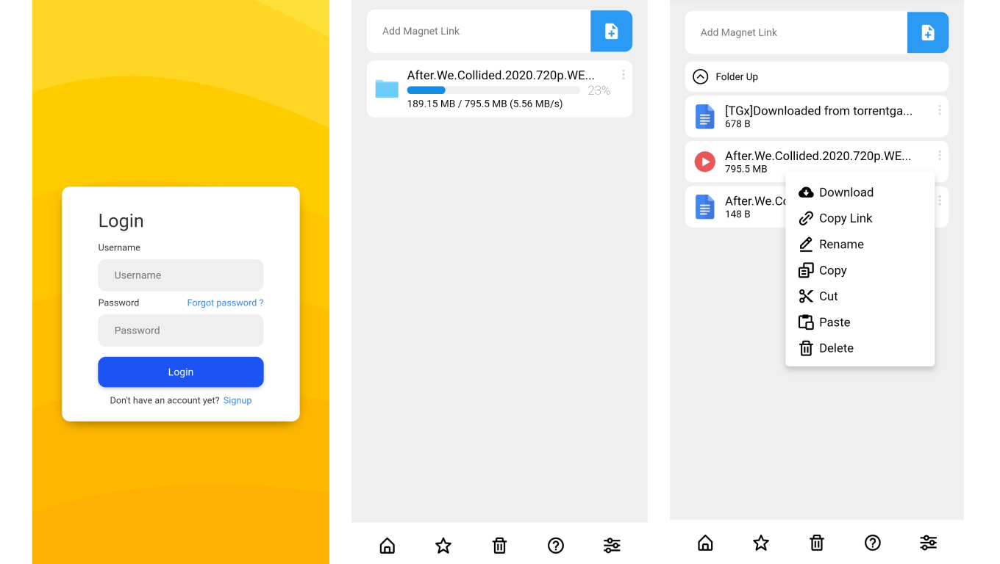
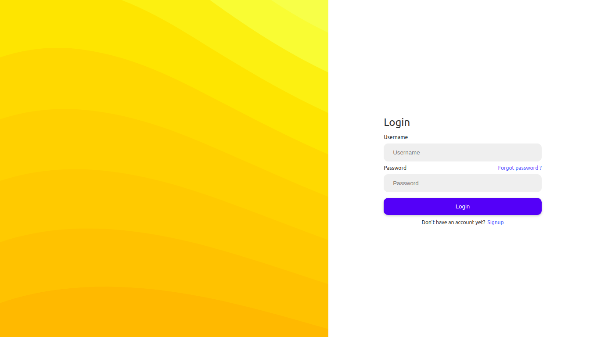
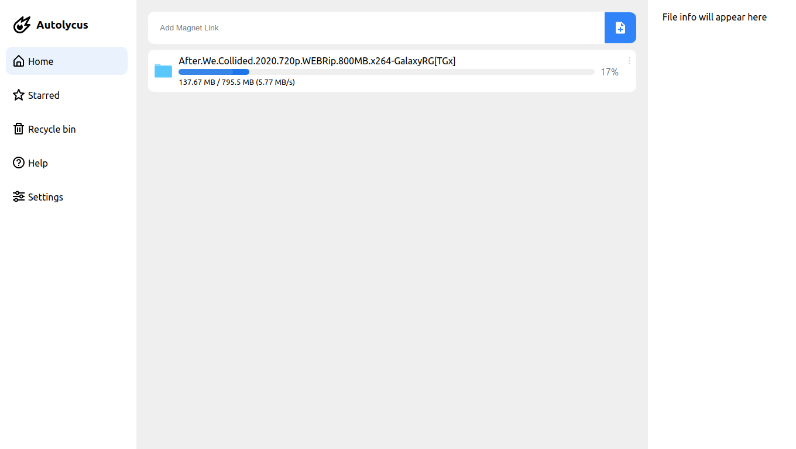

[![Contributors][contributors-shield]][contributors-url]
[![Forks][forks-shield]][forks-url]
[![Stargazers][stars-shield]][stars-url]
[![Issues][issues-shield]][issues-url]
[![LinkedIn][linkedin-shield]][linkedin-url]


<br />

<p align="center">
  <a href="https://github.com/imneonizer/autolycus">
    
  </a>

  <h3 align="center">Home server companion</h3>

  <p align="center">
    stream torrent files from hosted web servers remotely!
    <br />
    <a href="https://github.com/imneonizer/autolycus"><strong>Explore the docs »</strong></a>
    <br />
    <br />
    <a href="https://imneonizer.github.io/autolycus/">View Demo</a>
    ·
    <a href="https://github.com/imneonizer/autolycus/issues">Report Bug</a>
    ·
    <a href="https://github.com/imneonizer/autolycus/issues">Request Feature</a>
  </p>

</p>

<details open="open">
  <summary>Table of Contents</summary>
  <ol>
    <li>
      <a href="#about-the-project">About The Project</a>
      <ul>
        <li><a href="#built-with">Built With</a></li>
      </ul>
    </li>
    <li>
      <a href="#getting-started">Getting Started</a>
      <ul>
        <li><a href="#prerequisites">Prerequisites</a></li>
        <li><a href="#installation">Installation</a></li>
      </ul>
    </li>
    <li><a href="#usage">Usage</a></li>
    <li><a href="#roadmap">Roadmap</a></li>
    <li><a href="#contributing">Contributing</a></li>
    <li><a href="#license">License</a></li>
    <li><a href="#contact">Contact</a></li>
    <li><a href="#acknowledgements">Acknowledgements</a></li>
  </ol>
</details>
<!-- ABOUT THE PROJECT -->

## About The Project



There are lot of times when you want to access the specific content of a torrent file but don't want to waste bandwidth on downloading the entire file, this can be solved by downloading the file on a remote server and then browsing through the files.

* With remote file browsing / download support
* Optimized for both web and mobile views, responsive layout
* Built using React and Flask ⚡

A mobile first UI design so that you can enjoy the content seamlessly, Inspired by trending designs on [Dribble](https://dribbble.com/).

List of commonly used resources that I find helpful are listed in the acknowledgements.

### Built With

The application is containarized so that you don't need to go through the hassle of installing dependencies, tech stack used to built this application is listed below.
* [Python Flask](https://flask.palletsprojects.com/en/2.0.x/)
* [Libtorrent](https://libtorrent.org/)
* [React.js](https://reactjs.org/)
* [Postgres](https://www.postgresql.org/)
* [Docker](https://www.docker.com/)


<!-- GETTING STARTED -->

## Getting Started

This project is focused to run on server environment hence docker containers are used to deploy the application.

### Prerequisites

- [Ubuntu18.04+](https://ubuntu.com/tutorials/install-ubuntu-desktop#1-overview)

- [Docker](https://docs.docker.com/engine/install/ubuntu/)
- [docker-compose](https://docs.docker.com/compose/install/)

### Installation

2. Clone the repo
   ```sh
   git clone https://github.com/imneonizer/autolycus.git
   ```
3. Create `.env` file inside the project root folder, add the following to it (refer `example.env`)
   ```
   POSTGRES_DB=autolycus              # Postgresql database name
   POSTGRES_USER=admin                # Postgresql username
   POSTGRES_PASSWORD=admin            # Postgresql password
   API_URL=http://localhost:5000/api  # Endpoint at which the api will be serving
   ```
4. Run the containers
   ```JS
   sudo docker-compose up
   ```


<!-- USAGE EXAMPLES -->
## Usage

- When you run the application for the very first time It will ask you to login, you can signup for a new account and login with the credentials.

  

- Once logged in you can paste any valid torrent magnet link into the `Add Magnet` input field and it will start downloading the torrent file.

  


<!-- ROADMAP -->

## Roadmap

See the [open issues](https://github.com/othneildrew/Best-README-Template/issues) for a list of proposed features (and known issues).


<!-- CONTRIBUTING -->
## Contributing

Contributions are what make the open source community such an amazing place to be learn, inspire, and create. Any contributions you make are **greatly appreciated**.

1. Fork the Project
2. Create your Feature Branch (`git checkout -b feature/AmazingFeature`)
3. Commit your Changes (`git commit -m 'Add some AmazingFeature'`)
4. Push to the Branch (`git push origin feature/AmazingFeature`)
5. Open a Pull Request


<!-- LICENSE -->
## License

Distributed under the MIT License. See `LICENSE` for more information.


<!-- CONTACT -->
## Contact

Nitin Rai - [@imneonizer](https://twitter.com/imneonizer) - mneonizer@gmail.com

Project Link: [https://github.com/imneonizer/autolycus](https://github.com/imneonizer/autolycus)


<!-- ACKNOWLEDGEMENTS -->

## Acknowledgements
* https://github.com/CrazyCoder009/AUTOLYCUS/blob/master/AUTOLYCUS.ipynb
* https://stackoverflow.com/questions/57314357/streaming-video-files-using-flask
* https://codeburst.io/jwt-authorization-in-flask-c63c1acf4eeb
* https://flask-jwt-extended.readthedocs.io/en/stable/changing_default_behavior


<!-- MARKDOWN LINKS & IMAGES -->
<!-- https://www.markdownguide.org/basic-syntax/#reference-style-links -->

[contributors-shield]: https://img.shields.io/github/contributors/imneonizer/autolycus.svg?style=for-the-badge
[contributors-url]: https://github.com/imneonizer/autolycus/graphs/contributors
[forks-shield]: https://img.shields.io/github/forks/imneonizer/autolycus.svg?style=for-the-badge
[forks-url]: https://github.com/imneonizer/autolycus/network/members
[stars-shield]: https://img.shields.io/github/stars/imneonizer/autolycus.svg?style=for-the-badge
[stars-url]: https://github.com/imneonizer/autolycus/stargazers
[issues-shield]: https://img.shields.io/github/issues/imneonizer/autolycus.svg?style=for-the-badge
[issues-url]: https://github.com/imneonizer/autolycus/issues
[license-shield]: https://img.shields.io/github/license/imneonizer/autolycus.svg?style=for-the-badge
[license-url]: https://github.com/imneonizer/autolycus/blob/master/LICENSE.txt
[linkedin-shield]: https://img.shields.io/badge/-LinkedIn-black.svg?style=for-the-badge&logo=linkedin&colorB=555
[linkedin-url]: https://www.linkedin.com/in/imneonizer/