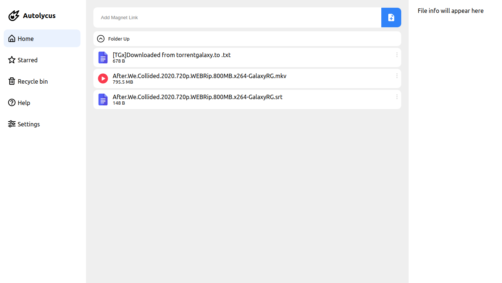
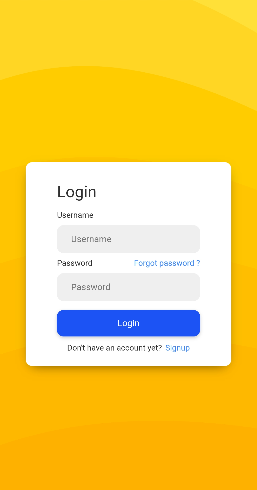
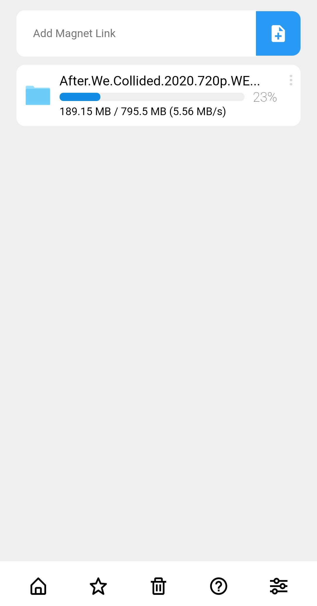
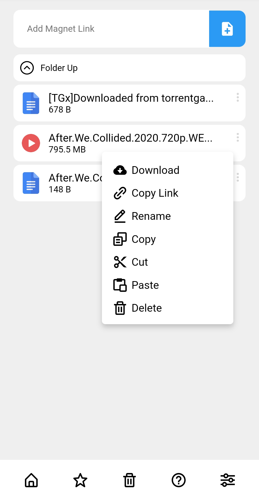

# Autolycus

A [seedr.cc](https://www.seedr.cc/) inspired web application to download torrent files on hosted web server.

- with remote file browsing / download support.
- Optimized for both web and mobile views, responsive layout.
- Built using React and Flask.

# How it looks

The app is fully optimised for desktop and mobile viewing. This is how it looks in different screen sizes

## Desktop views

<html>

<table>
    <tr>
        
    	
    	
    </tr>
</table>

</html>

## Mobile views

<html>

<table>
    <tr>
    	
        
        
    </tr>
</table>

</html>
